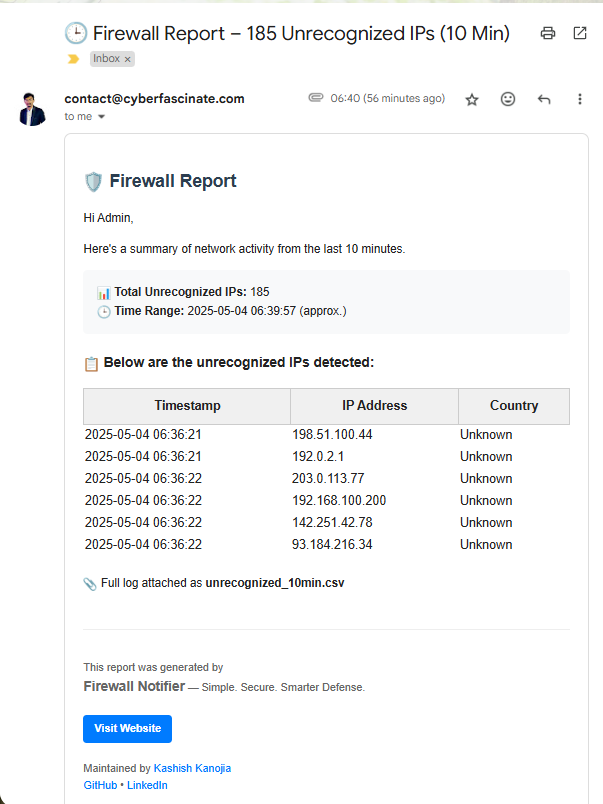

# 🔒 Firewall Notifier — Simple. Secure. Smarter Defense.

A real-time network monitoring tool that captures packets, filters them based on blacklist/whitelist rules, logs IP activity, and sends scheduled email reports.

🌐 **Official Website**: [https://firewallnotifier.cyberfascinate.com](https://firewallnotifier.cyberfascinate.com)

---

## ✨ Features

- 🧠 Real-time packet sniffing using `scapy`
- 🔍 Supports Blacklist, Whitelist, Both, or None filtering modes
- 🌐 CIDR-based range filtering (e.g., `192.168.0.0/24`)
- 📍 Geolocation lookup for IPs (optional)
- 📊 Live terminal dashboard using `rich`
- 📄 Logs all traffic to CSV (`firewall_logs.csv`)
- 📧 Sends professional HTML emails with:
  - Unrecognized IP reports
  - CSV attachment
- ⏱️ Scheduled reporting: every 1 / 5 / 10 / 15 minutes
- 📅 Daily summary report
- 🎨 Branded emails with website, GitHub, LinkedIn links
- 🛡️ Graceful exit with final report on `Ctrl+C`

---

## 🧩 Technologies Used

- Python 3.x
- [`scapy`](https://scapy.net/) – Packet capture & analysis
- [`rich`](https://github.com/Textualize/rich) – Terminal UI
- [`python-dotenv`](https://github.com/theskumar/python-dotenv) – Environment variables
- [`requests`](https://docs.python-requests.org/en/latest/) – Geolocation API
- SMTP – Email alerts

---

## 📦 Requirements

Before running, install dependencies:

```bash
pip install scapy rich python-dotenv colorama ipaddress requests
```

On Linux/macOS, you may also need:

```bash
sudo apt install libpcap-dev  # For scapy packet capture
```

---

## 🛠️ Setup Instructions

### 1. Clone the repo (if applicable)

```bash
git clone https://github.com/cyberfascinate/firewallnotifier.git
cd firewallnotifier
```

### 2. Create `.env` file

Create a `.env` file in the same folder as the script:

```env
SMTP_SERVER=smtp.gmail.com
SMTP_PORT=587
EMAIL_ADDRESS=your_email@gmail.com
EMAIL_PASSWORD=your_app_password
RECIPIENT_EMAIL=admin@example.com
GEOLocate=true
```

> ⚠️ Never commit this file! Add it to your `.gitignore`.

### 3. Run the script

```bash
sudo python3 firewall_notifier.py
```

> You need root privileges (`sudo`) for packet capture on most systems.

---

## 🧪 Sample Output

The tool will show live packet detection in the terminal and send emails like this:

| Feature | Description |
|--------|-------------|
| CLI Dashboard | Shows last seen IP and status |
| CSV Log | All captured IPs logged to `firewall_logs.csv` |
| Email Reports | Sent every 1/5/10/15 mins + daily |
| Exit Report | Triggered on `Ctrl+C` |

---

## 📬 Example Email Report



> *Includes timestamp, IP address, country, and full log attachment.*

---

## 🧰 Configuration Options

| Option | Description |
|--------|-------------|
| Filtering Mode | Choose from: Blacklist, Whitelist, Both, None |
| Geolocation | Enable via `.env`: `GEOLocate=true` |
| Email Alerts | Configured via `.env` |
| Logging | All data saved to `firewall_logs.csv` |
| Scheduled Reports | Every 1 / 5 / 10 / 15 min |
| Daily Summary | Sent once per day at midnight |

---

## 🧑‍💻 Maintained by

**Kashish Kanojia**

🔗 [GitHub](https://github.com/cyberfascinate/firewallnotifier)  
🔗 [LinkedIn](https://www.linkedin.com/in/cyberfascinate)  
📧 [contact@cyberfascinate.com](mailto:contact@cyberfascinate.com)  
🌐 [cyberfascinate.com](https://cyberfascinate.com)  
🛠️ Tool Website: [firewallnotifier.cyberfascinate.com](https://firewallnotifier.cyberfascinate.com)

---

## 📜 License

MIT License  
Self-hosted & secure  
Open source. Free to use, modify, and distribute.

---

## 🚀 Want More?

Let me know if you'd like help with:

- GUI version (Tkinter / PySide)
- Web dashboard (Flask + Bootstrap)
- Packaging into `.exe` or Docker image
- Integrating threat intelligence APIs (VirusTotal, AbuseIPDB)
- Auto-reporting to Slack or Teams

---

## ❤️ Support

If you found this useful, feel free to give it a star ⭐ on GitHub!

> "Security is not a product, but a process."  
> — Bruce Schneier

🛠️ **Firewall Notifier** – *Simple. Secure. Smarter Defense.*  
📌 Learn more → [firewallnotifier.cyberfascinate.com](https://firewallnotifier.cyberfascinate.com)
```
